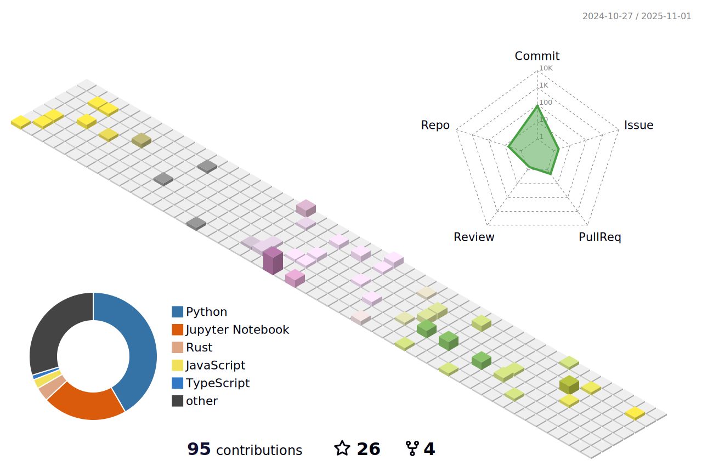

 
 ##  PommesPeter
 
<!--   -->
 
<!--  ### I Love ❤ the DeepLearning and Computer Vision👀 -->
<!--  -->

<!-- 

😎 About Me

-->

> [!NOTE]
> Welcome to my repositories. I hope you can enjoy everything here.

Hi , I'm **Peter**. 

I'm currently focusing on Robotics research, and investigating how to fully leverage multimodal information for VLA model. Also, I'm also very interested in studies focused on the generalization of VLA large models. 

Previously, during my undergraduate year, I worked on [PaddlePaddle](https://github.com/PaddlePaddle/Paddle) repo to enhance the functionality of its deeplearning framework. I finished the `i0/i0e`, `signbit`, and `polar` operators, and received the PaddlePaddle Developer Expert (a.k.a [PPDE](https://www.paddlepaddle.org.cn/ppde)) from [Paddle](https://www.paddlepaddle.org.cn). Moreover, I often tinker with various Linux distributions (Arch Linux, Ubuntu, etc.), Software-based routers, and NAS, for creating a more comfortable and enjoyable life, driven by my love for System Engineering.

<!-- <b> -->
<!--     <image src="https://github-readme-stats.vercel.app/api?username=pommespeter&show_icons=true&theme=tokyonight" height=150></image>
    <image src="https://github-readme-stats.vercel.app/api/top-langs/?username=pommespeter&layout=compact&theme=tokyonight&hide=html" height=150></image> -->
<!--  
  -->
<!-- </b> -->

 
 

Counting of visitors to this page in this section started on Aug 14, 2023:

 

<!-- <image src="https://github-profile-trophy.vercel.app/?username=pommespeter&theme=dracula&column=8"/> -->
<!--    -->

<!-- Currently Working on: -->
<!-- 
<image src="imgs/python.png"/>
 -->
<!--         -->
<!--     -->
<!--    -->
<!--     -->
<!--      -->
<!--   -->

<!-- -->
<!-- <b>
<image src="imgs/python.png"></image>
</b>
<b>
<image src="imgs/c++.png" width=175></image>
</b> -->

